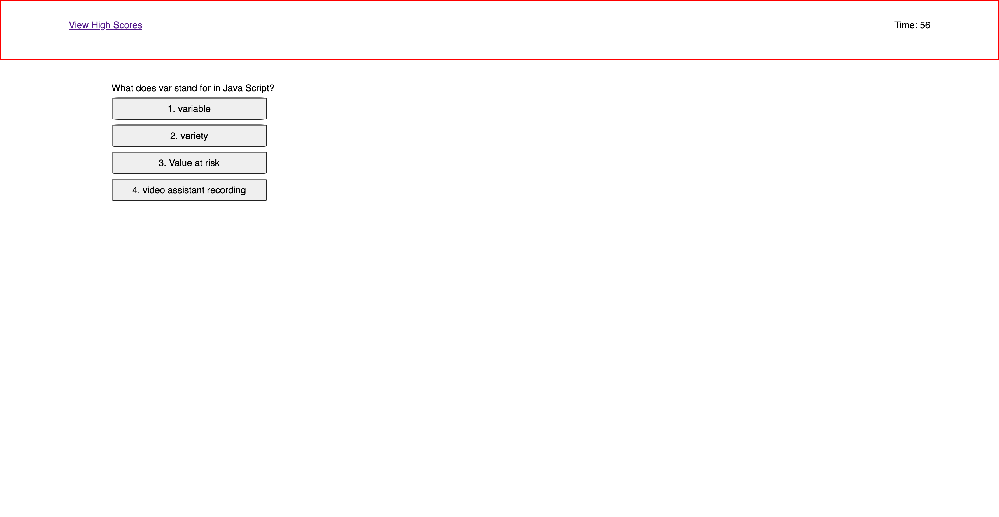

# The-Code-Quiz

***
## Description:
The challenge was to create a quiz on how to code.  The user will go through 6 questions and each point is worth 16 points (for all questions the highest score is 96).  If the user get an answer wrong, then 16 points will be subtracted and 10 seconds will also be subtracted to the timer.  There is 60 seconds on the timer.  At time 0 the quiz is over.  Once the game, or quiz is over the can save their initials and the high scores will be listed.  

## Links
github repository: https://github.com/rypab4/the-code-quiz
github SSH: git@github.com:rypab4/the-code-quiz.git
website https://rypab4.github.io/the-code-quiz/

## Directions
Open the website https://rypab4.github.io/the-code-quiz/
Press Start Quiz

Quiz will begin and you will answer 6 questions within 60 seconds (less if questions are answered wrong).

If all questions have been answered, or after 60 seconds, you will get a screen to enter your initials and your game score (highest is 96). 

Then it will show the high scores.  High scores can also be viewed by clicking high scores on the upper left hyperlink.

